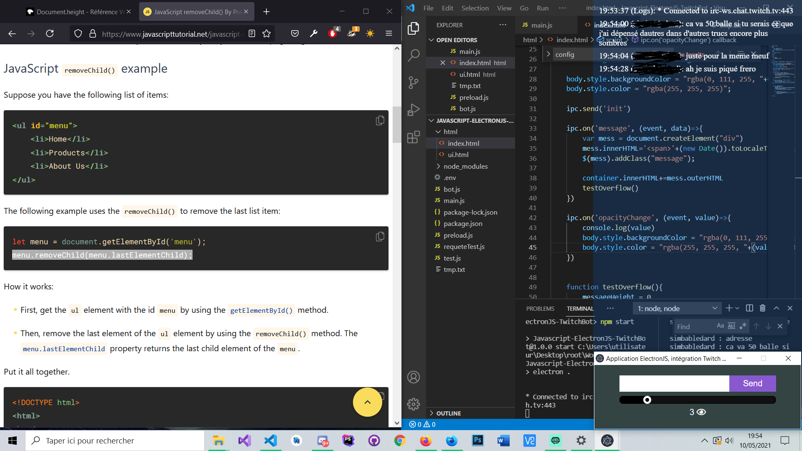
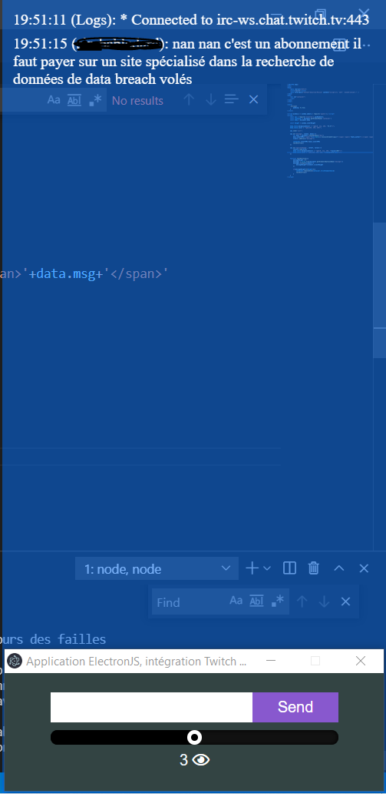

# Javascript-ElectronJs-TwitchOverlay

## Configuration
This software was made for people like me who wanna stream their coding adventure on a single screen. It makes it easy to interract with the chat and keep coding or playing at the same time. 

The app uses ElectronJS and Twitch API to work, if you wanna understand better how the API works, you can also take a look at my code. I use IRC and oauth to get app access token.

Let me know if this project was usefull to you!
 
## Configuration

Make a .env file to the root of the project. Here is the template :

```json
BOT_USERNAME=Your_bot_name  
OAUTH_TOKEN=Your_oauth_token (https://twitchapps.com/tmi/)
CHANNEL_NAME=Your_channel_name  
CLIENT_ID=Your_client_id (https://dev.twitch.tv/console/apps)  
CLIENT_SECRET=Your_client_secret (https://dev.twitch.tv/console/apps again)  
windowWidth=Width_of_chat (400 is pretty good)  
streamDataUpdate=Time_between_updates_for_stream_data_in_second (30 is a good value)
```
Exemple (with fake data)
```json
BOT_USERNAME=TwitchBot
OAUTH_TOKEN=2o21e9aen4rtf3xdet9uorzr63hdql
CHANNEL_NAME=clemiscoding
CLIENT_ID=gzawlerzuo28d2eq1revw23zvf6it5
CLIENT_SECRET=yf2ljtpsea93hxklbvzerue4nemu9q
windowWidth=400
streamDataUpdate=30
```

## Installation

- Config the .env file as shown
- Go to the project root and put this command: `npm install`
- Start the app with: `npm start`

There is no error handling if you env file is not well configured.

## Software screenshots



Keep 100% of your screen available while you stream. Choose background opacity and watch the viewer count.

## Code you can reuse from Twitch API

### IRC

```
//Quite the same code as twitch documentation
const opts = {
        identity: {
            username: process.env.BOT_USERNAME,
            password: process.env.OAUTH_TOKEN
        },
        channels: [
            process.env.CHANNEL_NAME
        ]
    };
    // Create a client with our options
    const client = new tmi.client(opts);
    // Register our event handlers (defined below)
    client.on('message', onMessageHandler);
    client.on('connected', onConnectedHandler);
```

### Get stream data
```
async function getStreamData() {
    var streamData
    //First request -> for authentification, you get your app access token from this request
    await axios.post(
            'https://id.twitch.tv/oauth2/token?client_id=' + process.env.CLIENT_ID + '&client_secret=' + process.env.CLIENT_SECRET + '&grant_type=client_credentials&scope=channel_read')
        .then(response => {
            oauthToken = response.data.access_token;
        })
        //Second requtest allows you to get stream data for a user (in this case it's you). Thanks to then oauth token you can proceed this request.
    await axios.get(`https://api.twitch.tv/helix/streams?user_login=${process.env.CHANNEL_NAME}`, {
        headers: {
            'Client-Id': process.env.CLIENT_ID,
            'Authorization': `Bearer ${oauthToken}`
        },
    }).then(result => {
        streamData = result.data
    }).catch(error => {
        console.log(error)
    });

    return streamData;
}
```

## Other stuff



## Liscence

I don't know a lot about liscences, feel free to use and reuse this code as you want.
